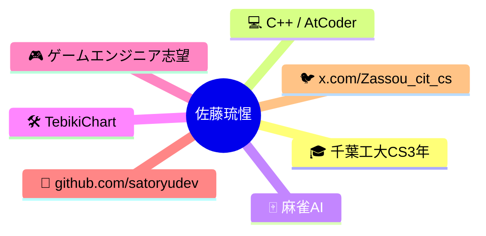

# Discord 自己紹介

## テキスト（200文字以内）

```
千葉工大CS3年の佐藤琉惺です。
C++と競プロが好きで、AtCoderで精進中。
麻雀AIやノーコードチュートリアルアプリを作ってます。
将来はゲームエンジニアを目指してます。
AIは友達です。

🔗 GitHub: https://github.com/satoryudev
🐦 X: https://x.com/Zassou_cit_cs
```

---

## Mermaid（200文字以内）


